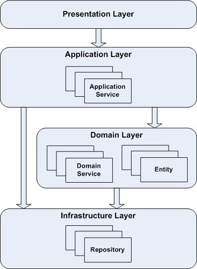

# Go Rest DDD API

A professional RESTful API project built using Go, adhering to Domain-Driven Design (DDD) principles and Clean Architecture. This project provides a robust foundation for building scalable and maintainable backend services.

## 1. Getting Started & Setup

### Prerequisites
- **Go**: Version 1.18 or higher.
- **Swag**: For generating Swagger documentation (`go install github.com/swaggo/swag/cmd/swag@latest`).

### Project Setup
Follow these steps to set up and run the project locally:

1.  **Clone the repository**:
    ```bash
    git clone https://github.com/leedev/go-rest-ddd.git
    cd go-rest-ddd
    ```

2.  **Generate Swagger Documentation**:
    Before starting the server, ensure the API documentation is up to date:
    ```bash
    make swag
    ```

3.  **Run the Development Server**:
    Start the application using the Makefile command:
    ```bash
    make start
    ```
    The server will be reachable at `http://localhost:8800`.

### Makefile Commands
- `make all`: Build the project binary.
- `make start`: Run the development server.
- `make build`: Compile the project into a binary (`server-cli`).
- `make clean`: Remove build artifacts and binaries.
- `make swag`: Generate Swagger 2.0 documentation.

---

## 2. DDD Architecture & Project Structure

This project follows the **Domain-Driven Design (DDD)** approach to separate concerns and ensure that the business logic remains isolated from infrastructure details.

### Core Layers
- **Presentation (Controller)**: Handles entry points (HTTP, gRPC), request validation, and DTO mapping.
- **Application (Service)**: Orchestrates business use cases. It interacts with the domain and infrastructure layers but contains no pure business logic.
- **Domain**: The heart of the application. Contains entities, value objects, and repository interfaces. It is completely isolated from other layers.
- **Infrastructure (Persistence)**: Implements the repository interfaces defined in the domain layer, handling database operations, external APIs, etc.

### Structural Flow: User Module Example
The diagram below illustrates how data and logic flow through the layers, using the `user` module as a reference:



#### Flow Breakdown:
1.  **Request**: Inbound HTTP requests hit the **Controller** (`internal/user/controller/http`).
2.  **Orchestration**: The Controller calls the **Application Service** (`internal/user/application/service`).
3.  **Business Logic**: The Service interacts with **Domain Entities** (`internal/user/domain/model/entity`) to apply business rules.
4.  **Persistence**: The Service uses **Repository Interfaces** (`internal/user/domain/repository`) to persist data.
5.  **Implementation**: The actual data access is handled by the **Infrastructure** implementation (`internal/user/infrastructure/persistence/repository`).

---

## 3. API Documentation
Once the server is running, you can access the interactive Swagger UI at:
[http://localhost:8800/swagger/index.html](http://localhost:8800/swagger/index.html)
